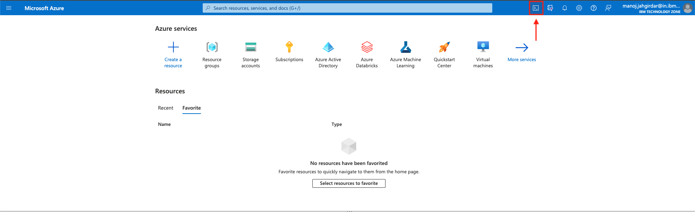

# IBM-Azure Trusted AI Use case

Build and Deploy machine learning models in Azure Machine Learning Studio and Monitor them in Watson OpenScale

## Introduction

State the purpose of your tutorial, your intended audience, and the benefits readers can gain from it. Aim to grab the reader’s interest quickly, using terms they are likely to search on and relate to.

## Use case Scenario

Consider a financial services company which is interested in expanding loan offerings to a broader audiance. To avoid costly lending mistakes, the organization decides to make use of Artificial Intelligence to process loan applications. You will experience a Data Scientist persona where you will build & deploy machine learning models in Azure machine learning studio using Azure Services to predict risk level for each loan applicant. You will also experience a CIO & customer care personas where you will monitor the machine learning models in Watson OpenScale. Watson OpenScale will help you determine if the model is providing fair and accurate predictions.

## Prerequisites

* [IBM Cloud Account](https://cloud.ibm.com/)

## Estimated time

It will take approximately 1 hour to complete the steps under normal circumstances.

## Steps

### Step 0: Create a Watson OpenScale Instance on IBM Cloud

You can create a free OpenScale account on IBM Cloud by following the steps below.
- Login to [IBM Cloud](https://cloud.ibm.com/).
- Create a Free [OpenScale Instance](https://cloud.ibm.com/catalog/services/watson-openscale) by choosing the Lite plan.

At this point you have successfully created an OpenScale Instance that will be used to monitor model built and deployed in Azure Machine Learning.

### Step 1: Setup Microsoft Azure Resources

>Note: You will get access to Microsoft Azure Subscription through the IBM TechZone.

You will first experience a Data Scientist persona where you will build & deploy machine learning models in Azure machine learning studio using Azure Services to predict risk level for each loan applicant. You can start by setting up the azure resources.

- Launch the Azure Cloud Shell from the Microsoft Azure Dashboard.


- You will be prompted to create a storage account to store the data. Go ahead and click on **create storage**.


- Once the Storage Account is created, you will see the bash prompt. Run the following command to get the GitHub repo with the Artefacts.

    ```
    git clone https://github.com/IBM/ibm-azure-trusted-ai.git
    ```

- Go to the cloned directory by running the following command.

    ```
    cd ibm-azure-trusted-ai/
    ```

- In the cloned directory, run the setup script to deploy resources on your Azure Subscription.

    ```
    ./setup.sh
    ```

    >Note: You need either `Owner` or `Global Administrator` privilages to setup a service principal as part of the script.

- The script will take about 10-15min to complete and you should see an output as shown below.


At this point, you have successfully setup the following resources on your Azure Subscription:

1. Created a Resource Group named 'trusted-ai'.
2. Deployed Azure Machine Learning workspace named 'trusted-ai-dev', Key vault, Application Insights & Storage account in the 'trusted-ai' resource group.
3. Created an Azure Machine Learning Compute Instance named 'techzone'.
4. Uploaded the Data Scientist Notebooks to Azure File Shares.
5. Created a service principal and copied the credentials to the same Azure File Shares.

### Step 2: Access Azure Machine Learning workspace

Now that you have setup all the resources on Azure, you can start the data scientist experience by launching the Azure Machine Learning workspace.

- Search for 'trusted-ai-dev' in the Azure search bar and select the Azure Machine Learning workspace resource.


- Click on **Launch studio** to launch Azure Machine Learning Studio where you will be building and deploying the credit risk model.

- Click on the **Notebooks** tab in the left panel to view the three artefacts that were uploaded as part of the setup script in previous step.
    - **Credit-risk-model.ipynb**: This is the primary notebook that you will be running as a Data Scientist to build, deploy the Credit Risk model in Azure Machine Learning Studio using Azure SDKs and also you will be setting up Watson OpenScale monitors using the Watson SDKs in the same notebook.
    - **Drift-Detection-Model.ipynb**: This is the second notebook that you will be running to build a base Drift model and upload it in Watson OpenScale.
    - **azuremlcredentials.json** : This is the credentials file that was created as part of service principal creation and these credentials will be used by Watson OpenScale to access the Machine Learning Model deployed in Azure Machine Learning Studio.

- Select the **Credit-risk-model.ipynb** to get started.


- Run the first three code cells and restart the kernel.

- There are two code blocks in the notebook that need your attention.

- The first block required IBM Cloud API Key. Update the `CLOUD_API_KEY` variable with IBM Cloud API Key.

<details><summary><b>How to generate IBM Cloud API Key?</b></summary>

- Login to IBM Cloud.
- Goto **[Manage > Access (IAM)](https://cloud.ibm.com/iam/overview)**.
- Select **API keys** in the left panel and click on **create**. Enter a name and description and click on **create**.
- You can download the key and copy it to clipboad. Once the popup window is dismissed you won't be able to see the API key again.


</details>

- Second block requires IBM Cloud Object Storage API Key, Resource CRN and URL. Update `COS_API_KEY_ID`, `COS_RESOURCE_CRN` & `COS_ENDPOINT` variables.

<details><summary><b>How to get Cloud Object Storage Credentials?</b></summary>

- Create a free [Object Storage](https://cloud.ibm.com/objectstorage/create) on IBM Cloud.

- Create a bucket in Object Storage as it will be used to store the machine learning model's training dataset and it will be accessed in OpenScale to run the Explainability monitor.

    

- Once the bucket is created, click on the **Configuration** tab and copy the **Bucket instance CRN**.

    

- You will also need to copy the **public endpoint** of your bucket.

    

- Finally create an API key to access the bucket. Click on **Service Credentials** in the left panel and click on **New credentials**. Open the credential and copy the API Key.
    
    

</details>

- Run the entire Notebook to learn about the credit risk model that is built & deployed in Azure Machine Learning Studio. Also learn about setting up fairness, quality, drift & explainability monitors in Watson OpenScale using SDKs in notebook.

### Step 3: Monitor the credit risk model in Watson Openscale

- Launch the [OpenScale Dashboard](https://aiopenscale.cloud.ibm.com/aiopenscale/).


## Summary

State any closing remarks about the task or goal you described and its importance. Reiterate specific benefits the reader can expect from completing your tutorial. Recommend a next step (with link if possible) where they can continue to expand their skills after completing your tutorial.

## Related links

Include links to other resources that may be of interest to someone who is reading your tutorial.
