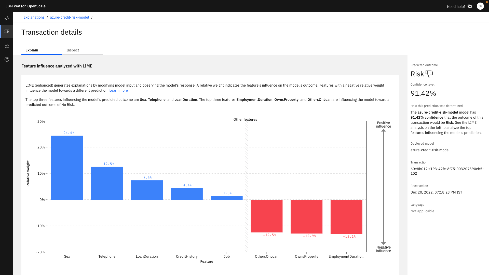

# IBM-Azure Trusted AI Use case

Build and Deploy machine learning models in Azure Machine Learning Studio and Monitor them in Watson OpenScale.

## Introduction

The organisations are at different level of AI and ML maturity. They want to operationalize AI but they lack the right set of tools to create that trust. There are challenges from different personas in a organization. Data Scientist struggles with trying to detect bias in the model, they also face challenges related to finding the right set of tools to show accuracy or drifts. From a CIO persona there is a need to ensure that the model is not biased on protected data like age, gender, disability, because the liability an organisation would have to incur in case of such a bias would not only be financial, but also reputational. Also in typical FSS Industry there is a need to explain each transaction for auditing purposes. For a customer the challenges are different. For example, a loan applicant would like to know why a negative prediction was made. And this is where the call centre executive basically struggle to give them a reasoning because most of the models are black boxes. Precisely this is where IBM Watson OpenScale comes into the picture because it helps ensure that the models remain fair, explainable and compliant. Not only that, it is a single solution that allows model monitoring across a multi cloud environment. The models can be hosted in Azure ML or a different hyperscaler, even open source models for that matter, and OpenScale can monitor the models seamlessly.

## Architecture


For the purpose of the demo, this is the component architecture that we will be working on. There are three phases Build, Deploy & Monitor.

The Build phase essentially works on Azure Storage account, where it makes use of Azure Files Shares to store the datasets along with Azure Machine Learning Studio to build machine learning models with Jupyter Notebooks for Code Approach and Automated ML or Designer for no-code approach. Once that is complete, Azure Machine Learning Studio is again leveraged for the deploy phase where model is deployed as a web service in Azure Machine Learning Studio. Finally, IBM Watson OpenScale configured on IBM Cloud Pak for Data provisioned on Microsoft Azure is going to monitor the four key KPIs that are Fairness, Quality, Drift and Explainability.

## Use case Scenario

Consider a financial services company which is interested in expanding loan offerings to a broader audiance. To avoid costly lending mistakes, the organization decides to make use of Artificial Intelligence to process loan applications. You will experience a Data Scientist persona where you will build & deploy machine learning models in Azure machine learning studio using Azure Services to predict risk level for each loan applicant. You will also experience a CIO & customer care personas where you will monitor the machine learning models in Watson OpenScale. Watson OpenScale will help you determine if the model is providing fair and accurate predictions.

## Prerequisites

* [IBM Cloud Account](https://cloud.ibm.com/)

## Estimated time

It will take approximately 1 hour to complete the steps under normal circumstances.

## Video

Coming soon!

## Steps

### Step 0: Create a Watson OpenScale Instance on IBM Cloud

You can create a free OpenScale account on IBM Cloud by following the steps below.
- Login to [IBM Cloud](https://cloud.ibm.com/).
- Create a Free [OpenScale Instance](https://cloud.ibm.com/catalog/services/watson-openscale) by choosing the Lite plan.

At this point you have successfully created an OpenScale Instance that will be used to monitor model built and deployed in Azure Machine Learning.

### Step 1: Setup Microsoft Azure Resources

>Note: You will get access to Microsoft Azure Subscription through the IBM TechZone.

You will first experience a Data Scientist persona where you will build & deploy machine learning models in Azure machine learning studio using Azure Services to predict risk level for each loan applicant. You can start by setting up the azure resources.

- Launch the Azure Cloud Shell from the Microsoft Azure Dashboard.


- You will be prompted to create a storage account to store the data. Go ahead and click on **create storage**.


- Once the Storage Account is created, you will see the bash prompt. Run the following command to get the GitHub repo with the Artefacts.

    ```
    git clone https://github.com/IBM/ibm-azure-trusted-ai.git
    ```

- Go to the cloned directory by running the following command.

    ```
    cd ibm-azure-trusted-ai/
    ```

- In the cloned directory, run the setup script to deploy resources on your Azure Subscription.

    ```
    ./setup.sh
    ```

    >Note: You need either `Owner` or `Global Administrator` privilages to setup a service principal as part of the script.

- The script will take about 10-15min to complete and you should see an output as shown below.


At this point, you have successfully setup the following resources on your Azure Subscription:

1. Created a Resource Group named 'trusted-ai'.
2. Deployed Azure Machine Learning workspace named 'trusted-ai-dev', Key vault, Application Insights & Storage account in the 'trusted-ai' resource group.
3. Created an Azure Machine Learning Compute Instance named 'techzone'.
4. Uploaded the Data Scientist Notebooks to Azure File Shares.
5. Created a service principal and copied the credentials to the same Azure File Shares.

### Step 2: Access Azure Machine Learning workspace

Now that you have setup all the resources on Azure, you can start the data scientist experience by launching the Azure Machine Learning workspace.

- Search for 'trusted-ai-dev' in the Azure search bar and select the Azure Machine Learning workspace resource.


- Click on **Launch studio** to launch Azure Machine Learning Studio where you will be building and deploying the credit risk model.

- Click on the **Notebooks** tab in the left panel to view the three artefacts that were uploaded as part of the setup script in previous step.
    - **Credit-risk-model.ipynb**: This is the primary notebook that you will be running as a Data Scientist to build, deploy the Credit Risk model in Azure Machine Learning Studio using Azure SDKs and also you will be setting up Watson OpenScale monitors using the Watson SDKs in the same notebook.
    - **Drift-Detection-Model.ipynb**: This is the second notebook that you will be running to build a base Drift model and upload it in Watson OpenScale.
    - **azuremlcredentials.json** : This is the credentials file that was created as part of service principal creation and these credentials will be used by Watson OpenScale to access the Machine Learning Model deployed in Azure Machine Learning Studio.

- Select the **Credit-risk-model.ipynb** to get started.


- Run the first three code cells and restart the kernel.

- There are two code blocks in the notebook that need your attention.

- The first block required IBM Cloud API Key. Update the `CLOUD_API_KEY` variable with IBM Cloud API Key.

<details><summary><b>How to generate IBM Cloud API Key?</b></summary>

- Login to IBM Cloud.
- Goto **[Manage > Access (IAM)](https://cloud.ibm.com/iam/overview)**.
- Select **API keys** in the left panel and click on **create**. Enter a name and description and click on **create**.
- You can download the key and copy it to clipboad. Once the popup window is dismissed you won't be able to see the API key again.


</details>

- Second block requires IBM Cloud Object Storage API Key, Resource CRN and URL. Update `COS_API_KEY_ID`, `COS_RESOURCE_CRN` & `COS_ENDPOINT` variables.

<details><summary><b>How to get Cloud Object Storage Credentials?</b></summary>

- Create a free [Object Storage](https://cloud.ibm.com/objectstorage/create) on IBM Cloud.

- Create a bucket in Object Storage as it will be used to store the machine learning model's training dataset and it will be accessed in OpenScale to run the Explainability monitor.

    

- Once the bucket is created, click on the **Configuration** tab and copy the **Bucket instance CRN**.

    

- You will also need to copy the **public endpoint** of your bucket.

    

- Finally create an API key to access the bucket. Click on **Service Credentials** in the left panel and click on **New credentials**. Open the credential and copy the API Key.
    
    

</details>

- Run the entire Notebook to learn about the credit risk model that is built & deployed in Azure Machine Learning Studio. Also learn about setting up fairness, quality, drift & explainability monitors in Watson OpenScale using SDKs in notebook.

At this point, you have completed the activities of a Data Scientist.

### Step 3: Monitor the credit risk model in Watson Openscale

You will now see how Watson OpenScale is going to answer the problems of a CIO persona.

CIO persona Struggles with the challenge of bias in the models outcome. If a model has bias in it and it is put in production, then there are going to be a lot of repercussions, financially and reputational.

You will not put on the hat of a CIO persona.

- Launch the [OpenScale Dashboard](https://aiopenscale.cloud.ibm.com/aiopenscale/).

- You should see the `azure-credit-risk-model` registered in OpenScale Dashboard.

    

- Select the model to view the Explaination Summary, Fairness Test, Quality Test & Drift Test.

    

#### Evaluation Summary

The evaluation summary screen presents the test results from the latest evaluation.


#### Fairness Test

Fairness describes how evenly the model delivers favourable outcomes between groups. The metrices section presents results for the evaluation.


You can click on the small arrow mark on the top right of the Fairness monitor to view evaluation details.


You can see the two features `Age` & `Sex` that are being monitored to check for bias. These features were set by the Data Scientist persona back in the Azure Machine Learning Studio.

<details><summary><b>View Azure Machine Learning Studio where these parameters were set for monitoring</b></summary>


</details>

>Note: Watson OpenScale can also analyze the training data to recommend which feature should be monitored.

The dashboard shows graph that of all the transactions. You can click on any data point to view more details about how the disparate impact score was determined.


As a CIO persona, you will observe this disparate impact, Favorable outcomes and the bias if any and report it as a feedback to the Data Scientist persona. The Data Scientist will work on mitigating the bias of the model.

#### Quality Test

Quality describes the models ability to provide correct outcomes based on labeled test data called feedback data.


You can click on the small arrow mark on the top right of the Quality monitor to view evaluation details.

There are 9 different metrices that can be set for Quality Test. As a Data Scientist you have configured the `Area Under ROC` back in the Azure Machine Learning Studio.

<details><summary><b>View Azure Machine Learning Studio where this parameter was configured</b></summary>


</details>


You can see Area under ROC violation of 0.11 that is 11%. Click on the data point to view the confusion matrix.


#### Drift Test

Drift warns of drop in accuracy or data consistency. If the accuracy of the model decreases then it is considered as **drop in accuracy**. If the data is very different from the training data then it is considered as **Drop in data consistency**.


You can click on the small arrow mark on the top right of the Drift monitor to view evaluation details.


The drift monitor estimates the drop in accuracy of the model and the drop in data consistency based on the training data. Click on a data point to view details.


You can view the transactions responsible for a drop in accuracy, a drop in data consistency, or both. Click on a group to view reason for drop in accuracy/drop in data consistency along with Recommendation that is in Natural Language that can be understood by anyone.


The model can be retrained to eleminate the model and data drifts.

#### Explainability

Explainability is the model's ability to describe how the model arrived at a perticular prediction.

Click on the **Find a Transaction** button on the left panel. Select the deoloyed model `azure-credit-risk-model`. You will see the list of all the transactions. You can click on **Explain** to view explaination of a perticular transaction.


You can see the features that have influenced the prediction. The features are sorted by their importance in influencing the models prediction.



You can Inspect the models behaviour to explore how changing feature values will influence model outcomes. A hypothetical transaction presents a different set of feature values that results in a different outcome.


Suppose a customer who has not got a loan and he/she wishes to know what do they have to improve in order to become eligable for the loan, can be analyzed using the Inspect feature of the Explainability monitor.


By using this feature, Watson OpenScale can analyze the model and provide a suggestion.

### Step 4: Cleanup Resources

Now that you have successfully completed the exercise, you can go ahead and clean up the resources on Azure.

- Launch the Azure Cloud Shell from the Microsoft Azure Dashboard.

- Go to the cloned directory by running the following command.

    ```
    cd ibm-azure-trusted-ai/
    ```

- In the cloned directory, run the cleanup script to delete resources on your Azure Subscription.

    ```
    ./cleanup.sh
    ```

    

## Summary

In this exercise, you experienced the Data Scientist persona's roles i.e. you built and deployed a Machine Learning Model to predict credit risk using Azure Machine Learning Services. You also experienced the CIO and Customer care personas where you monitored the four KPIs i.e. Fairness, Quality, Drift & Explainability using IBM Watson OpenScale. 

To Summarise, The solution helps in solving the technical and business problems that were highlighted in the introduction. The Data Scientist now has the visibility to monitor model performance, even once they are put in production, and there by reduce the cost due to the early detection of drop in accuracy if detected. The CIO and CDO are now able to detect biasis and they feel confident to use AI as it is fair and auditable. Finally the customer, in this case the loan applicant is provided with more feedback and the call center executives have the right set of tools i.e. the explainability monitor that explains why a loan was not granted and also using the what if analysis, OpenScale highlights, changing which feature would result in a different outcome.

## Related links

- [OpenScale Python SDKs 3.0.26](http://ibm-watson-openscale-client.mybluemix.net/)
- [Mitigating bias](https://dataplatform.cloud.ibm.com/docs/content/wsj/model/wos-insight-debias.html?audience=wdp)
- [Custom ML frameworks](https://dataplatform.cloud.ibm.com/docs/content/wsj/model/wos-frameworks-custom.html)
